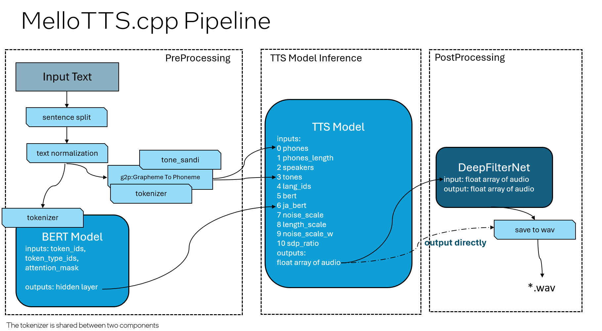

# MeloTTS.cpp
<p>
   <b>< <a href='./README.md'>English</a> </b> | <b>简体中文</b> | <a href='./README.zh-TW.md'>繁體中文</a>  >
</p>

**MeloTTS.cpp** 是[meloTTS](https://github.com/myshell-ai/MeloTTS) 的 C++ 实现，**MeloTTS**是由 MyShell.ai 发布的一个高质量、多语言的文本转语音 (Text To Speech) 库，支持英语、中文以及其他多种语言。本仓库基于**OpenVINO**，支持在 CPU、GPU 和 NPU 边缘设备上的部署。目前，本仓库支持中文(混合英文)和纯英语。计划支持[MeloTTS 日文模型](https://huggingface.co/myshell-ai/MeloTTS-Japanese)。


## 针对中英混合的中文 TTS

这个分支专注于为中英混合的中文提供语音合成（TTS）解决方案。

### 需要多语言支持？

如果您需要多语言的 TTS 解决方案，可以切换到 `multilang-develop` 分支。

切换到该分支，请运行：
```bash
git checkout multilang-develop
```
更多细节，请访问[MeloTTS.cpp 多语言分支](https://github.com/apinge/MeloTTS.cpp/tree/multilang-develop)

## Pipeline Design

MeloTTS.cpp的设计与 [原始 PyTorch 版本](https://github.com/myshell-ai/MeloTTS) 基本一致，由三个模型组成（BERT、TTS 和 DeepFilterNet），其中 DeepFilterNet 是额外新增的模型。





#### 图例
1. tokenizer and BERT: tokenizer和 BERT 模型为中文使用 `bert-base-multilingual-uncased`，英文使用 `bert-base-uncased`
2. g2p: Grapheme-to-Phoneme 
3. phones and tones: 中文表示为拼音和四声，英文表示为音标和重音
4. tone_sandi: 纠正分词和音素的类（仅用于中文）
5. DeepFilterNet: 用于降噪（由 int8 量化引入的背景噪声）


### Model-Device Compatibility Table
下表概述了每个模型支持的XPU：
| Model Name       | CPU Support | GPU Support | NPU Support |
|------------------|-------------|-------------|-------------|
| BERT (Preprocessing) | ✅           | ✅           | ✅           |
| TTS (Inference)      | ✅           | ✅           | ❌           |
| DeepFilterNet (Post-processing) | ✅           | ✅           | ✅           |

## Setup and Execution Guide

### 1. 下载 OpenVINO C++ Package


要下载适用于 Windows 的 OpenVINO C++ 包，请参考以下链接：[Install OpenVINO for Windows]( https://docs.openvino.ai/2024/get-started/install-openvino/install-openvino-archive-windows.html)。
对于 OpenVINO 2024.5 在 Windows 上的安装，您可以在命令提示符（cmd）中运行命令行。
```
curl -O https://storage.openvinotoolkit.org/repositories/openvino/packages/2024.5/windows/w_openvino_toolkit_windows_2024.5.0.17288.7975fa5da0c_x86_64.zip --ssl-no-revoke
tar -xvf w_openvino_toolkit_windows_2024.5.0.17288.7975fa5da0c_x86_64.zip
```

对于 Linux，您可以从以下链接下载 C++ 包：[Install OpenVINO for Linux](https://docs.openvino.ai/2024/get-started/install-openvino/install-openvino-archive-linux.html)。对于 OpenVINO 2024.5 在 Linux 上的安装，只需从 https://storage.openvinotoolkit.org/repositories/openvino/packages/2024.5/linux 下载并解压该包。

有关其他版本和更多 OpenVINO 信息，请访问 OpenVINO 官方工具包页面：[OpenVINO Toolkit Overview](https://www.intel.com/content/www/us/en/developer/tools/openvino-toolkit/overview.html)

### 2. Clone仓库
```
git lfs install
git clone https://github.com/apinge/MeloTTS.cpp.git
```

### 3. 编译与运行
#### 3.1 Windows 编译与运行
```
<OpenVINO_DIR>\setupvars.bat
cd MeloTTS.cpp
cmake -S . -B build && cmake --build build --config Release
.\build\Release\meloTTS_ov.exe --model_dir ov_models --input_file inputs.txt  --output_file audio.wav
```
#### 3.2 Linux 编译与运行
```
source <OpenVINO_DIR>/setupvars.sh
cd MeloTTS.cpp 
cmake -S . -B build && cmake --build build --config Release
./build/meloTTS_ov --model_dir ov_models --input_file inputs.txt --output_file audio.wav
```
#### 3.3 在cmake里启用和禁用 DeepFilterNet
DeepFilterNet 功能目前仅在 Windows 上支持，用于过滤 int8 量化模型中的噪声。默认情况下，该功能是启用的，但您可以在 CMake 阶段使用 `-DUSE_DEEPFILTERNET` 选项来启用或禁用它。

例如，要禁用此功能，您可以在 CMake 生成过程中使用以下命令：
```
cmake -S . -B build -DUSE_DEEPFILTERNET=OFF
```
有关更多信息，请参阅[DeepFilterNet.cpp](https://github.com/apinge/MeloTTS.cpp/blob/develop/src/deepfilternet/README.md).

### 4. 参数说明

可以使用 `run_tts.bat` 或 `run_tts.sh` 作为示例脚本来运行模型。以下为参数说明：

- `--model_dir`: 指定包含模型文件、字典文件和第三方资源文件的文件夹，该文件夹为仓库中的 `ov_models` 文件夹。您可能需要根据当前工作目录调整相对路径。
- `--tts_device`: 指定用于 TTS 模型的 OpenVINO 设备。支持的设备包括 CPU 和 GPU（默认：CPU）。
- `--bert_device`: 指定用于 BERT 模型的 OpenVINO 设备。支持的设备包括 CPU、GPU 和 NPU（默认：CPU）。
- `--nf_device`: 指定用于 DeepfilterNet 模型的 OpenVINO 设备。支持的设备包括 CPU、GPU 和 NPU（默认：CPU）。
- `--input_file`: 指定要处理的输入文本文件。确保文本是 **UTF-8** 格式。
- `--output_file`: 指定要生成的输出 *.wav 音频文件。
- `--speed`: 指定输出音频的速度。默认值为 1.0。
- `--quantize`: 指示是否使用 int8 量化模型。默认值为 `false`，表示默认使用 fp16 模型。
- `--disable_bert`: 指示是否禁用 BERT 模型推理。默认值为 false。
- `--disable_nf`:  指示是否禁用 DeepfilterNet 模型推理（默认：`false`）。
- `--language`: 指定 TTS 的语言。默认语言为中文（`ZH`）。

## NPU设备支持
BERT 和 DeepFilterNet 模型支持将 NPU 作为推理设备，利用 Meteor Lake 和 Lunar Lake 中集成的 NPU。

以下是启用的方法:
<details>
  <summary>Click here to expand/collapse content</summary>
  <ul>
   <li><strong>在 CMake 生成阶段</strong></li>
   在 NPU 上启用 BERT 模型，在 CMake 生成阶段需要额外的 CMake 选项 <code>-DUSE_BERT_NPU=ON</code>。例如：
    <pre><code>cmake -DUSE_BERT_NPU=ON -B build -S .</code></pre>
   在 NPU 上启用 DeepFilterNet，无需额外的编译步骤。
   <li><strong>设置参数</strong></li>
        要为 NPU 上的模型设置参数，分别使用 <code>--bert_device NPU</code>来设置 BERT 模型，使用 <code>--nf_device NPU</code> 来设置 DeepFilterNet 模型。例如：
        <pre><code>build\Release\meloTTS_ov.exe --bert_device NPU --nf_device NPU --model_dir ov_models --input_file inputs.txt  --output_file audio.wav</code></pre>
    
</ul>
</details>

## 版本支持
- **Operating System**: Windows, Linux
- **CPU Architecture**: Metor Lake, Lunar Lake, 大多数Intel CPUs
- **GPU Architecture**: Intel® Arc™ Graphics (Intel Xe, 包括iGPU)
- **NPU  Architecture**: NPU 4, Meteor Lake, Lunar Lake中集成的NPU
- **OpenVINO Version**: >=2024.4
- **C++ Version**: >=C++20

如果您使用的Windows 的 AI PC 笔记本，GPU 和 NPU 驱动通常已经预装。Linux用户或希望更新到最新驱动的Windows用户请参考以下指南操作

- **安装/更新GPU驱动**: 请参考 [Configurations for Intel® Processor Graphics (GPU) with OpenVINO™](https://docs.openvino.ai/2024/get-started/configurations/configurations-intel-gpu.html) 

- **安装/更新NPU驱动**: 请参考 [NPU Device](https://docs.openvino.ai/2024/openvino-workflow/running-inference/inference-devices-and-modes/npu-device.html) 

请注意，Windows 和 Linux 的所有驱动程序有所不同，因此请确保按照您特定操作系统的说明进行操作。

## 开发计划

1. **实现MeloTTS日文版本**
   
2. **提高量化质量**:
   - 当前的INT8量化模型表现出轻微的背景噪声。我们集成了 DeepFilterNet 进行后处理。未来的目标是通过量化技术解决噪声问题。

## Python版本

Python 版本（集成 OpenVINO 的 MeloTTS）可以在 [MeloTTS-OV](https://github.com/zhaohb/MeloTTS-OV/tree/speech-enhancement-and-npu) 中找到。Python 版本包括将模型转换为 OpenVINO IR 的方法。

## 第三方代码和库
参考了以下仓库

- [cppjieba](https://github.com/yanyiwu/cppjieba)
    - C++中文分词库
- [cppinyin](https://github.com/pkufool/cppinyin)
    - C++汉语拼音库，我们剥离了其python部分整合在代码中
- [libtorch](https://github.com/pytorch/pytorch/blob/main/docs/libtorch.rst)
   - 用于DeepFilterNet


